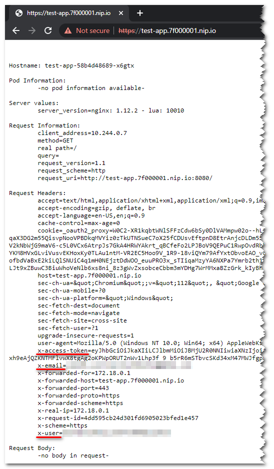

# Authentication Proxy

Example of how to use `oauth2-proxy` along with `ingress-nginx` to provide
single OpenID Connect authentication proxy for multiple Kubernetes applications
having the same parent DNS domain.

# Deployment

0. Prerequisites:
   * Working Docker installation
   * [Kind](https://kind.sigs.k8s.io/) installed, or a working Kubernetes cluster
1. Copy `auth/env.sample` to `auth/.env` and update it accordingly
2. Create Kubernetes cluster: `./create-kind-cluster.sh` unless you already have a working cluster
3. Deploy [ingress-nginx](https://github.com/kubernetes/ingress-nginx): `kubectl apply -f ingress-nginx.yaml`
4. Deploy [oauth2-proxy](https://oauth2-proxy.github.io/oauth2-proxy/): `kubectl apply -k auth`
5. Deploy "app1" application: `kubectl apply -f app1.yaml`
6. Deploy "app2" and "app3": `seq 2 3 | xargs -I{} sed 's/app1/app{}/' app1.yaml | kubectl apply -f-`

# Testing

> Note:
>
> For the DNS names resolution to ingress configs available at 127.0.0.1 we use
> https://nip.io service and so DNS domain becomes `.7f000001.nip.io`.

With your browser access https://app1.7f000001.nip.io/. You will need to accept
few certificate warnings as the solution uses self-signed certificates.

You should be redirected to the configured OpenID Connect provider's sign-in page.
Once successufully authenticated, you should see a page similar to the one below:



Notice `x-user`, `x-email` and `x-access-token` headers present in the request
sent to app1.7f000001.nip.io and populated by oauth2-proxy auth_request
integration.

For the application to be integrated with the authentication proxy, its ingress
needs the following annotations, as specified in [app1.yaml](app1.yaml):

```yaml
  annotations:
    nginx.ingress.kubernetes.io/auth-signin: "https://auth.7f000001.nip.io/oauth2/start?rd=$scheme%3A%2F%2F$host$escaped_request_uri"
    # For the auth_request URL use Kubernetes service URL to not leave the cluster and speed things up
    nginx.ingress.kubernetes.io/auth-url: "http://oauth2-proxy.default.svc.cluster.local:4180/oauth2/auth"
    nginx.ingress.kubernetes.io/configuration-snippet: |
      auth_request_set $user   $upstream_http_x_auth_request_user;
      auth_request_set $email  $upstream_http_x_auth_request_email;
      auth_request_set $token  $upstream_http_x_auth_request_access_token;
      proxy_set_header X-User         $user;
      proxy_set_header X-Email        $email;
      proxy_set_header X-Access-Token $token;
```

Using your browser you should also be able to access https://app2.7f000001.nip.io
(accept the same certificate warnings).

Trying to access https://app3.7f000001.nip.io in the same browser session that
was used to access "app1" or "app2" will be allowed as all 3 applications share
the same domain and the cookie was set for that common domain - `.7f000001.nip.io`.
However, opening a new browser session and trying to access directly "app3" will
not be allowed because this application domain is not specified in
`oauth2-proxy` whitelisted domains list.

> TODO:
>
> Is there a way to prevent "app3" from highjacking the session cookie created
> during "app1" or "app2" authentication?
> Is there a way for "auth-url" request (/oauth2/auth) to verify the domain the
> request is coming from?

# Cleanup

```bash
kind delete cluster
```
